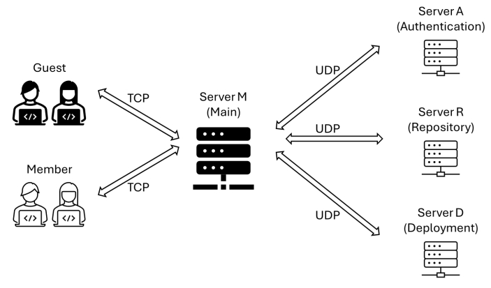

# EE450 Socket Programming Project - Git450
**Chih-Cheng Hsieh 6024588048**

## Overview
This project implements a simplified version of a version control platform similar to GitHub using C. After authentication, users can perform various operations, including:
* **Lookup:** View documents within a specific user's repository.
* **Push:** Upload documents to server.
* **Deploy:** Retrieve all documents of the user and deploy them on server.
* **Remove:** Delete existing documents from server.
* **Log:** View the user's history operations.

In addition, there are two types of users:
* **Members:** Members have full access to the platform's functionalities. They can log in to their account to manage files stored on the server and view their operation history.
* **Guests:** Guests have limited access to the platform. They can only look up the members' documents.

## System Architecture
The client (Guest or Member) connects to the Main Server via TCP protocol, while the three backend servers communicate with the Main Server using UDP protocol.\
　　　　　　　　　　
* **Client:** A user interface for command input, response display, and filtering invalid commands.
* **Main Server (serverM):** A central server that receives commands from the client, dispatches tasks to the appropriate backend servers, identifies guest users, and records each member's command history.
* **Authentication Server (serverA):** A backend server that verifies user membership using `members.txt` and handles password encryption.
* **Repository Server (serverR):** A backend server that maintains the document list of members `filenames.txt`, allowing users to view, upload, and delete documents.
* **Deployment Server (serverD):** A backend server that maintains a list of deployed documents .

## Features
* Implemented dynamic port assignment to prevent port conflicts when multiple clients run simultaneously.
* Used `fork()` on main server to create new child processes to hand requests from multiple clients concurrently.
* Implemented a simple authentication mechanism with password encryption.
* Designed structures to store history commands and file informations.

## Usage
1. Compile all files
```
make
```
2. Launch servers in following order
```
./serverM
./serverA
./serverR
./serverD
```
3. Launch clients with credentials

```
# guest login
./client guest guest

# member login
./client <username> <password>
```

## Reused Code
* **Socket Setup:** https://beej-zhtw.netdpi.net/client-server_basic
* **Structure:** https://hackmd.io/@ndhu-programming-2021/ryQV46uRt
* **File operations:** https://www.freecodecamp.org/chinese/news/file-handling-in-c-how-to-open-close-and-write-to-files/
